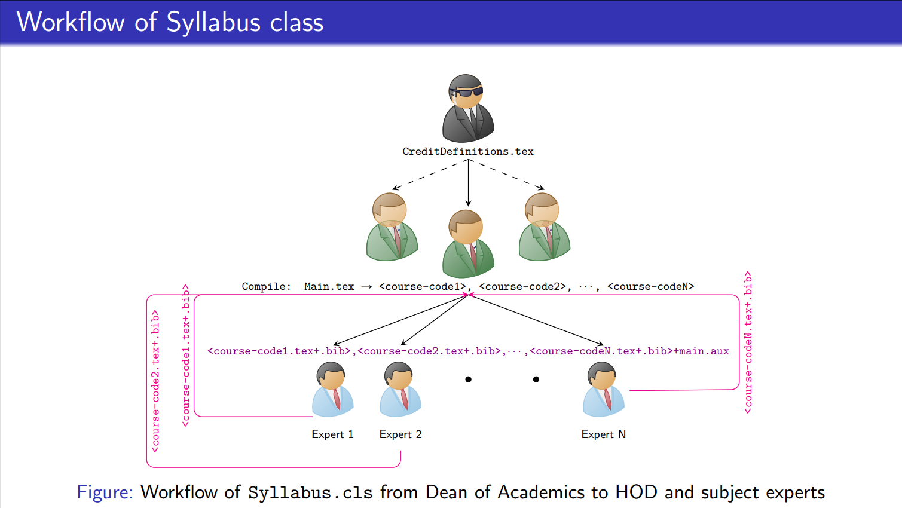

# syllabus
This is the class file meant to create syllabus book.
1. Supports 4 basic course-types, namely: 1. LO (Lecture only), 2. PO (Practical only), 3. LP (Lecture & Practical) and 4. LT (Lecture & Tutorial).
1. Each course-types can supports variants to accommodate different credit/CIE/SEE Values/Marks/Durations, CIE rubrics and SEE rubrics.
1. Creates table of content containing course code, course title and its page number.
1. Creates Credit table containing course code, course title and its credit distribution.
1. Supports adding references to the course, by adding citation in each course accompanied `<course-code>.bib` and using its corresponding cite key.
1. Supports 3 types group wrapping, namely: 1. Core group (`coregroup` environment), 2. Ability Enhancement group (`aegroup` environment), 3. Elective group (`electivegroup` environment).
1. Supports skill lab group wrapping environment, using 1. `sklabs` environment within the `semester` environment and 2. `skgroup` environment outside the `semester` environment.

## Process Flow:
The process flow to use this class is given below:

1. Different credit-types with variants must be first defined by Dean of Academics along with HODs and syllabus coordinators of the departments. This ensures common distribution of marks, rubrics required by different courses and all the variants necessary across departments.
1. HOD of the respective departments with the subject experts and department syllabus coordinators define the courses in Main.tex file, with **course code**. Each course can be mapped to anyone of the predefined course-types with variants.
```
\documentclass{syllabus}

\begin{document}
\begin{semester}{3} % Semester {3} defines the semester. Here we have defined 2 courses
\begin{definecourse}{ma121ai} % <ma121ai> is the course code
	\coursetitle[LO]{Elements of electronics}
\end{definecourse}
\begin{definecourse}{ec121ai}
	\coursetitle[LO]{Elements of electronics}
\end{definecourse}
\end{semester}

\end{document}
```
3. Based on the course code, generate a template file named `<course-code>.tex`.
```
	LP									LO							LT							PO
\begin{course}{1}{1}                \begin{course}{1}{2}        \begin{course}{1}{3}         \begin{course}{1}{4}
    \prerequisites{}                    \prerequisites{}            \prerequisites{}            \prerequisites{}        
    \begin{units}                       \begin{units}               \begin{units}               \begin{practicals}           
        \unit[4]{sample}                    \unit[4]{sample}            \unit[4]{sample}            \practicetitle{Hardware}
    \end{units}                         \end{units}                 \end{units}                     \experiment{Design}             
    \begin{practicals}                  \begin{courseoutcomes}      \begin{courseoutcomes}          \practiceeltitle{Outcome}
        \practicetitle{Hardware}            \co{sample}                 \co{sample}                 \experiment[EL]{Design}
        \experiment{Design}             \end{courseoutcomes}        \end{courseoutcomes}        \end{practicals}
        \practiceeltitle{Outcome}       \begin{references}          \begin{references}          \begin{courseoutcomes}
        \experiment[EL]{Design}             \reference{Razavi2000}      \reference{Razavi2000}      \co{sample}
    \end{practicals}                    \end{references}            \end{references}            \end{courseoutcomes}
    \begin{courseoutcomes}          \end{course}                \end{course}                    \begin{references}
        \co{sample}                                                                                 \reference{Razavi2000}
    \end{courseoutcomes}                                                                        \end{references}
    \begin{references}                                                                      \end{course}
    %Add citation key defined in reference.bib file in the current directory
    %As an example, a predefined key is added here under \referencecommand.
        \reference{Razavi2000}
    \end{references}
\end{course}
```
4. The subject experts will define the course details like, unit-wise hours and contents for lecture, list of experiments for practice
4. Read the contents of <course-code>.tex and including practicals and store this information onto aux file.
5. Read the Data from aux file and build a table.

## Yet...
1. Need to support PG syllabus